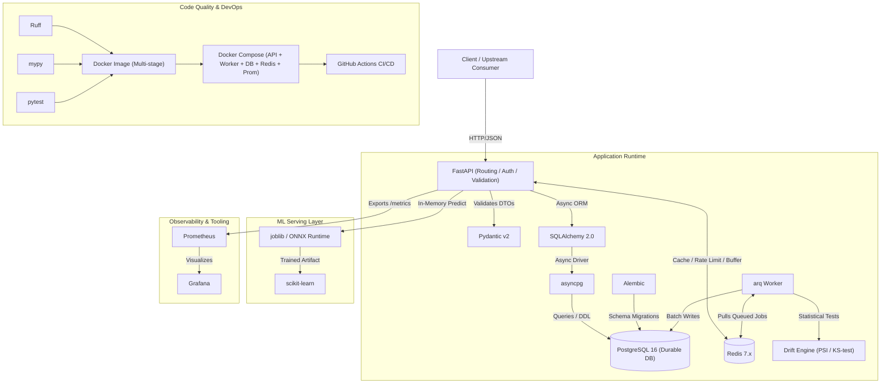

# 01 — Technology Stack & Core Concepts

This document provides a concise, technically rigorous introduction to every technology, tool, and fundamental engineering concept used in **ModelOps Sentinel**. It serves as your quick-reference study guide for SDE, MLE, and Backend/Platform interviews.

---

## Technology Categorization

```
┌────────────────────────────────────────────────────────────────────────┐
│                        MODELOPS SENTINEL PLATFORM                      │
└───────────────────────────────────┬────────────────────────────────────┘
                                    │
    ┌───────────────┬───────────────┼───────────────┬────────────────┐
    │               │               │               │                │
┌───▼────┐      ┌───▼────┐      ┌───▼────┐      ┌───▼────────┐   ┌───▼────┐
│  CORE  │      │SUPPORT │      │   ML   │      │OBSERVABIL- │   │ DEVOPS │
│        │      │        │      │        │      │    ITY     │   │        │
└────────┘      └────────┘      └────────┘      └────────────┘   └────────┘
```

- **CORE**: Python, FastAPI, Pydantic, SQLAlchemy 2.0, asyncpg, PostgreSQL, Alembic, Redis, arq.
- **SUPPORTING (Auth & Systems Concepts)**: JWT, bcrypt, JSONB, REST APIs, HTTP Status Codes, async/await, Database Transactions, Database Indexes, Row Locking, Caching, Message Queues.
- **ML & SERVING (Artifacts, Lifecycle & Drift)**: scikit-learn, joblib, ONNX Runtime, Model Versioning, Canary Deployment, Shadow Deployment, Data Drift, PSI, KS Test.
- **OBSERVABILITY**: Prometheus, Grafana.
- **DEVOPS & QUALITY**: Docker, Docker Compose, pytest, Ruff, mypy, GitHub Actions.

---

## Dependency & Relationship Map



---

## 1. CORE TECHNOLOGIES

### Python (3.11+)
1. **What it is**: High-level, interpreted programming language with strong typing support via type annotations.
2. **Why we need it**: Industry standard for ML ecosystems; rich asynchronous web framework support.
3. **Where it appears**: Entire codebase (API, worker, ML utilities, tests).
4. **What problem it solves**: Eliminates impedance mismatch between ML artifact generation and backend serving logic.
5. **Important concept**: **Global Interpreter Lock (GIL) & Asynchronous Event Loops** — asynchronous Python handles high I/O concurrency on a single thread by switching tasks during `await`, but true CPU-bound tasks (e.g., heavy model inference) block the event loop unless offloaded to a worker process or executed in C-extensions.
6. **Interview question**: *How does `asyncio` achieve high concurrency without multi-threading, and what happens to the event loop when a CPU-bound function is called without `await`?*

---

### FastAPI
1. **What it is**: Modern, high-performance web framework for building APIs with Python based on Starlette and Pydantic.
2. **Why we need it**: Native `async/await` support, automatic OpenAPI (Swagger) documentation, fast serialization, and robust dependency injection.
3. **Where it appears**: API process entrypoint (`app/main.py`), routers, middleware, and request/response pipelines.
4. **What problem it solves**: Replaces slow, synchronous frameworks (Flask/Django) that require WSGI workers; handles thousands of concurrent I/O connections with minimal memory.
5. **Important concept**: **Dependency Injection (`Depends`)** — decoupling database sessions, authentication credentials, and service instances from route handlers for testability.
6. **Interview question**: *What is ASGI, and how does FastAPI differ fundamentally from WSGI-based frameworks like Flask under high concurrent I/O load?*

---

### Pydantic (v2)
1. **What it is**: Data validation and settings management library powered by a Rust core (`pydantic-core`).
2. **Why we need it**: Strict validation of incoming inference features, configuration management, and API contract enforcement.
3. **Where it appears**: Request/Response DTOs (`app/schemas/`), environment settings (`app/core/config.py`).
4. **What problem it solves**: Prevents malformed, out-of-bounds, or missing features from reaching models or database queries; guarantees type coercion.
5. **Important concept**: **Data Parsing vs. Type Casting** — Pydantic parses input into guaranteed shapes, raising detailed 422 Unprocessable Entity errors when validation fails.
6. **Interview question**: *Why is strict schema validation particularly critical at the boundary of a Machine Learning serving system compared to a traditional CRUD app?*

---

### SQLAlchemy 2.0
1. **What it is**: Enterprise-grade Object-Relational Mapper (ORM) and SQL toolkit for Python.
2. **Why we need it**: Provides type-safe database queries, transactional integrity, relational associations, and unit-of-work patterns.
3. **Where it appears**: Data access layer and entities (`app/models/`, `app/repositories/`).
4. **What problem it solves**: Eliminates raw SQL string bugs and SQL injection; supports 2.0-style explicit `select()` statements with native async sessions.
5. **Important concept**: **AsyncSession Lifecycle & Identity Map** — ensuring sessions are scoped per request, avoiding shared mutable state across async coroutines.
6. **Interview question**: *What is the difference between lazy loading and eager loading in SQLAlchemy, and why is lazy loading dangerous in async code?*

---

### asyncpg
1. **What it is**: High-performance, asynchronous PostgreSQL client library for Python.
2. **Why we need it**: Direct binary protocol communication with PostgreSQL for maximum async throughput; used as the driver for SQLAlchemy.
3. **Where it appears**: Database connection engine URL (`postgresql+asyncpg://...`).
4. **What problem it solves**: Traditional drivers (like `psycopg2`) are blocking and stall the Python asyncio event loop during DB queries.
5. **Important concept**: **Connection Pooling** — maintaining an active pool of open database connections to avoid the heavy TCP/TLS handshake latency on every request.
6. **Interview question**: *Why can't you use a synchronous database driver like standard `psycopg2` inside an `async def` FastAPI route handler?*

---

### PostgreSQL (16+)
1. **What it is**: Enterprise-grade, ACID-compliant open-source relational database.
2. **Why we need it**: Central durable source of truth for users, API keys, model metadata, versions, deployment configurations, and audit telemetry.
3. **Where it appears**: Persistent database container; stores all relational tables.
4. **What problem it solves**: Guarantees ACID properties for financial-grade metadata and prevents data corruption during concurrent writes.
5. **Important concept**: **ACID Guarantees & MVCC (Multi-Version Concurrency Control)** — readers do not block writers, and writers do not block readers.
6. **Interview question**: *How does PostgreSQL MVCC handle concurrent updates to the same row, and what is write amplification?*

---

### Alembic
1. **What it is**: Database migration tool built specifically for SQLAlchemy.
2. **Why we need it**: Tracks, versions, and applies incremental database schema changes (tables, indexes, foreign keys) over time.
3. **Where it appears**: `migrations/` folder, migration revisions, and Docker startup commands.
4. **What problem it solves**: Prevents schema drift across environments; eliminates dangerous manual `ALTER TABLE` commands in production.
5. **Important concept**: **Linear Migration History & Rollback Scripts (`upgrade` / `downgrade`)** — every change must be reversible.
6. **Interview question**: *Why is `Base.metadata.create_all()` unacceptable in production, and how do database migrations prevent data loss during zero-downtime deployments?*

---

### Redis (7.x)
1. **What it is**: In-memory, single-threaded (event-loop based) key-value data structure store.
2. **Why we need it**: Sub-millisecond inference result caching, atomic rate limiting, task queue broker for `arq`, and high-throughput telemetry buffer.
3. **Where it appears**: Ephemeral state tier; used in middleware, inference service, and worker queue.
4. **What problem it solves**: Protects the API from redundant model execution and shields PostgreSQL from high-frequency telemetry write spikes.
5. **Important concept**: **Data Eviction Policies (e.g., volatile-lru)** & **Atomic Operations (INCR, LPUSH, RPOP)**.
6. **Interview question**: *How does Redis achieve single-threaded high performance, and what happens when memory fills up under heavy caching?*

---

### arq
1. **What it is**: High-performance, lightweight job queue system for Python designed specifically for `asyncio` and powered by Redis.
2. **Why we need it**: Runs background batch inference, periodic telemetry flushing, drift calculations, and deployment health checks outside the API process.
3. **Where it appears**: Worker entrypoint (`app/worker.py`), async job definitions (`app/tasks/`).
4. **What problem it solves**: Avoids the heavy architectural footprint of Celery + RabbitMQ while maintaining native `asyncio` compatibility.
5. **Important concept**: **Job Scheduling & Redis Streams/Sorted Sets** — jobs are scheduled with unique keys, pulled asynchronously, and retried upon failure with exponential backoff.
6. **Interview question**: *Why should heavy ML inference or drift calculations never be run inside FastAPI's default `BackgroundTasks` in a production API?*

---

## 2. SUPPORTING TECHNOLOGIES & CONCEPTS

### JWT (JSON Web Tokens)
1. **What it is**: Stateless, cryptographically signed token standard (RFC 7519) for transmitting claims between parties.
2. **Why we need it**: Secure authentication for human users (Engineers/Admins) managing models, deployments, and viewing dashboards.
3. **Where it appears**: `app/modules/auth/`, headers (`Authorization: Bearer <token>`).
4. **What problem it solves**: Eliminates server-side session lookups in the database for every administrative HTTP request.
5. **Important concept**: **Signature Verification vs. Encryption** — JWT payload is base64-encoded (visible to anyone), but tamper-proof due to the cryptographic signature (HMAC-SHA256).
6. **Interview question**: *How do you invalidate a stateless JWT before its expiration time if a user's permissions are revoked?*

---

### bcrypt
1. **What it is**: Adaptive cryptographic password-hashing function based on the Blowfish cipher.
2. **Why we need it**: Safely hashes user passwords and API keys before storing them in PostgreSQL.
3. **Where it appears**: `app/modules/auth/security.py`.
4. **What problem it solves**: Protects credentials against rainbow table and brute-force attacks via automatic salting and configurable computational work factor.
5. **Important concept**: **Work Factor (Cost Parameter)** — computational rounds can be increased over time as hardware gets faster, keeping brute-force attacks infeasible.
6. **Interview question**: *Why is SHA-256 unsuitable for password storage, whereas bcrypt or Argon2 is mandatory?*

---

### JSONB (PostgreSQL)
1. **What it is**: Decomposed binary format for storing JSON data in PostgreSQL with full indexing support.
2. **Why we need it**: Stores dynamic model input schemas, raw feature payloads, model metadata, and drift statistical metrics without rigid schemas.
3. **Where it appears**: Columns in `models`, `model_versions`, `inferences`, and `drift_reports` tables.
4. **What problem it solves**: Blends relational integrity with NoSQL schema flexibility for variable ML inputs.
5. **Important concept**: **GIN (Generalized Inverted Index)** — allows querying nested JSON keys with fast index lookups (e.g., `WHERE features @> '{"age": 30}'`).
6. **Interview question**: *What is the difference between `JSON` and `JSONB` in PostgreSQL, and what are the trade-offs during write vs. read operations?*

---

### REST APIs
1. **What it is**: Architectural style for distributed hypermedia systems utilizing standard HTTP methods and stateless communication.
2. **Why we need it**: Standard interface for clients to request predictions, register models, and manage deployments.
3. **Where it appears**: All route definitions under `app/api/v1/`.
4. **What problem it solves**: Provides a universally understood, language-agnostic contract for microservices and frontend clients.
5. **Important concept**: **Idempotency** — `GET`, `PUT`, `DELETE` are idempotent (repeated identical calls have the same outcome); `POST` is non-idempotent.
6. **Interview question**: *What makes an HTTP method idempotent, and why does that distinction matter when designing retry logic in client SDKs?*

---

### HTTP Status Codes
1. **What it is**: Standardized 3-digit response codes defined by RFCs indicating the outcome of an HTTP request.
2. **Why we need it**: Clear communication of operational results to client SDKs (200 OK, 202 Accepted, 400 Bad Request, 401 Unauthorized, 403 Forbidden, 404 Not Found, 422 Unprocessable Entity, 429 Too Many Requests, 503 Service Unavailable).
3. **Where it appears**: API route return types and exception handlers.
4. **What problem it solves**: Prevents the anti-pattern of returning `200 OK` with `{ "error": "something failed" }` in the body.
5. **Important concept**: **202 Accepted vs. 200 OK** — `202 Accepted` indicates the request was validated and enqueued for async processing (batch jobs), but execution is not complete.
6. **Interview question**: *When would you return a 422 vs. 400, and what is the semantic purpose of a 202 Accepted in asynchronous architectures?*

---

### async / await
1. **What it is**: Syntactic sugar in Python for defining asynchronous coroutines running on an event loop.
2. **Why we need it**: Allows a single Python process to handle thousands of concurrent network I/O calls (DB, Redis, network requests) without thread overhead.
3. **Where it appears**: Route handlers, database queries, Redis interactions, and worker tasks.
4. **What problem it solves**: Context switching between threads in OS is expensive; async cooperative multitasking yields control voluntarily during I/O.
5. **Important concept**: **Non-blocking Cooperative Multitasking** — calling a blocking library (like standard `time.sleep()` or `requests.get()`) halts the *entire* event loop for *all* concurrent users.
6. **Interview question**: *What happens behind the scenes when Python encounters the `await` keyword in an asynchronous function?*

---

### Database Transactions
1. **What it is**: A logical unit of database work consisting of one or more operations executed under ACID guarantees.
2. **Why we need it**: Ensures operations like "retire version A and activate version B" or "create model and create initial draft version" either succeed completely or rollback entirely.
3. **Where it appears**: SQLAlchemy session context managers (`async with session.begin(): ...`).
4. **What problem it solves**: Prevents partial, orphaned, or inconsistent database state when an error occurs halfway through an operation.
5. **Important concept**: **Atomicity & Isolation Levels** (Read Committed vs. Repeatable Read vs. Serializable).
6. **Interview question**: *What is a dirty read vs. a phantom read, and what isolation level does PostgreSQL use by default?*

---

### Database Indexes
1. **What it is**: Auxiliary data structure (predominantly B-Tree) that speeds up data retrieval on specific columns at the expense of write speed.
2. **Why we need it**: High-speed lookups on `api_key_hash`, `model_name`, `deployment_id`, and `created_at` timestamp ranges for drift queries.
3. **Where it appears**: SQLAlchemy model definitions and Alembic migration scripts.
4. **What problem it solves**: Eliminates full-table sequential scans ($O(N)$) on tables with millions of telemetry records, reducing query time to $O(\log N)$.
5. **Important concept**: **Composite Indexes & Column Cardinality** — ordering of columns in multi-column indexes matters for prefix matching.
6. **Interview question**: *Why does adding an index speed up `SELECT` queries but slow down `INSERT` and `UPDATE` operations?*

---

### Row Locking (`FOR UPDATE`)
1. **What it is**: Mechanism to lock specific database rows during a transaction to prevent concurrent modification.
2. **Why we need it**: Prevents race conditions when updating deployment traffic weights or updating batch job claim statuses across workers.
3. **Where it appears**: Repository methods modifying deployment states or claiming jobs (`SELECT ... FOR UPDATE SKIP LOCKED`).
4. **What problem it solves**: Prevents "lost updates" and race conditions when multiple worker instances or API requests attempt to mutate the same entity concurrently.
5. **Important concept**: **Pessimistic vs. Optimistic Locking** — Pessimistic locks the row explicitly in SQL; optimistic uses a version number column to detect conflicts at commit time.
6. **Interview question**: *How does `SELECT ... FOR UPDATE SKIP LOCKED` enable building a scalable, concurrent worker queue on top of a relational database without lock contention?*

---

### Caching
1. **What it is**: Storing frequently accessed, computationally expensive data in high-speed memory for rapid retrieval.
2. **Why we need it**: Serves repeat inference queries for identical feature vectors in sub-millisecond time; caches active deployment configs.
3. **Where it appears**: `app/modules/inference/cache.py` using Redis.
4. **What problem it solves**: Reduces redundant CPU/GPU compute and drops inference p99 latency from 50ms to 2ms on cache hits.
5. **Important concept**: **Cache-Aside (Lazy Loading) & Cache Invalidation** — app checks cache first; on miss, loads from source, populates cache with TTL, and writes back.
6. **Interview question**: *What are the three classic cache problems: Cache Penetration, Cache Breakdown, and Cache Avalanche, and how do you protect against them?*

---

### Message Queues
1. **What it is**: Asynchronous communication mechanism where messages/tasks are stored in a buffer until processed by consumers.
2. **Why we need it**: Decouples API request ingestion from heavy ML batch processing, telemetry flushing, and drift calculations.
3. **Where it appears**: Redis lists/streams used by `arq` workers.
4. **What problem it solves**: Eliminates HTTP timeouts, prevents API thread starvation, and provides load leveling during traffic spikes.
5. **Important concept**: **At-Least-Once Delivery & Idempotency** — workers may crash and re-consume a task; therefore, job execution must be idempotent.
6. **Interview question**: *What is backpressure in a queue-based system, and how do you prevent consumer starvation when queue depth spikes?*

---

## 3. ML, SERVING & MONITORING CONCEPTS

### scikit-learn
1. **What it is**: Fundamental Python machine learning library providing efficient tools for predictive data analysis.
2. **Why we need it**: Provides the standard model contract (`.fit()`, `.predict()`, `.predict_proba()`) for our canonical payload model.
3. **Where it appears**: Training scripts, validation pipelines, and model evaluation utilities.
4. **What problem it solves**: Standardized API contract for tabular ML; lightweight dependency compared to multi-gigabyte DL frameworks.
5. **Important concept**: **Estimator API & Pipeline Encapsulation** — packaging data preprocessing (imputation, scaling) and model estimator into a single serializable object to avoid training-serving skew.
6. **Interview question**: *What is training-serving skew, and how does bundling feature transformations into a scikit-learn Pipeline prevent it?*

---

### joblib
1. **What it is**: Set of tools providing lightweight pipelining and optimized serialization for Python objects containing large NumPy arrays.
2. **Why we need it**: Serializes and deserializes trained model artifacts to/from disk (`model.joblib`).
3. **Where it appears**: `app/modules/versions/` and `app/modules/inference/loader.py`.
4. **What problem it solves**: Standard `pickle` is slow and inefficient for large numerical matrices; `joblib.dump()` and `joblib.load()` optimize memory buffer handling.
5. **Important concept**: **Arbitrary Code Execution Risk** — unpickling an untrusted `.joblib` file can execute arbitrary malicious code; requires strict checksum verification and access control.
6. **Interview question**: *Why is deserializing a pickle/joblib file considered a severe security risk in production, and how do you mitigate it?*

---

### ONNX Runtime
1. **What it is**: High-performance, cross-platform inference engine for Open Neural Network Exchange (ONNX) models developed by Microsoft.
2. **Why we need it**: Optional optimized inference engine offering hardware-accelerated, low-latency execution independent of Python's runtime overhead.
3. **Where it appears**: Alternate inference execution engine (`app/modules/inference/onnx_engine.py`).
4. **What problem it solves**: Bypasses Python runtime overhead and GIL during inference; standardizes model deployment across frameworks (PyTorch, Sklearn, TF).
5. **Important concept**: **Graph Optimization & Quantization** — ONNX runtime optimizes computational graphs (node fusion, constant folding) to reduce latency.
6. **Interview question**: *What architectural advantages does ONNX provide when moving a model from research (PyTorch) to high-throughput production serving?*

---

### Model Versioning
1. **What it is**: Practice of tracking, tagging, and archiving distinct iterations of model artifacts, training data, schemas, and metrics.
2. **Why we need it**: Ensures complete reproducibility; allows rolling back to previous versions when a new model misbehaves.
3. **Where it appears**: `model_versions` table and `ARTIFACT_DIR/{model_name}/{version_tag}/`.
4. **What problem it solves**: Solves "it worked on my machine" and untracked file overwrite bugs; provides audit trails for compliance.
5. **Important concept**: **Semantic Versioning & Immutability** — once a model version (e.g., `v1.2.0`) is published and activated, its artifact binary and schema must never be mutated.
6. **Interview question**: *What information must be captured in a model registry alongside the binary weights to guarantee 100% reproducibility?*

---

### Canary Deployment
1. **What it is**: Deployment strategy where a new version (canary) is released to a small subset of production traffic alongside the stable version.
2. **Why we need it**: Tests new model versions on real live traffic with limited blast radius before promoting to 100%.
3. **Where it appears**: `app/modules/deployments/` and `app/modules/inference/router.py`.
4. **What problem it solves**: Eliminates all-or-nothing deployment outages; prevents faulty models from degrading user experience across the board.
5. **Important concept**: **Blast Radius Reduction & Automated Rollback** — if canary error rate or latency breaches a predefined threshold, traffic automatically reverts to baseline.
6. **Interview question**: *How do you implement deterministic sticky routing in a canary deployment so that a specific user consistently sees the same model version?*

---

### Shadow Deployment
1. **What it is**: Release pattern where production traffic is duplicated (forked); the incoming request is served by the active model, while the candidate model evaluates it in the background without affecting the user.
2. **Why we need it**: Benchmarks candidate model latency, stability, and prediction distribution against real production traffic with zero business risk.
3. **Where it appears**: Optional deployment routing mode in `app/modules/deployments/`.
4. **What problem it solves**: Identifies runtime bugs and performance bottlenecks under real production load without risking user-facing errors.
5. **Important concept**: **Asynchronous Forking** — the shadow prediction must be completely fire-and-forget; its latency or failure must never impact the primary response path.
6. **Interview question**: *What is the difference between Canary, Shadow, and Blue/Green deployment strategies in machine learning systems?*

---

### Data Drift (Covariate Shift)
1. **What it is**: Statistical change in the distribution of input features ($P(X)$) between training data and live production inference data over time.
2. **Why we need it**: Real-world data constantly shifts (user behavior, seasonality, sensor degradation), causing models to degrade silently.
3. **Where it appears**: Background drift worker job (`app/tasks/drift.py`) and `drift_reports` table.
4. **What problem it solves**: Detects model decay *before* ground-truth business metrics (which often have days or weeks of feedback delay) decline.
5. **Important concept**: **Covariate Shift vs. Concept Drift** — Covariate shift is $P(X)$ changing while $P(Y|X)$ remains constant; concept drift is the fundamental relationship between inputs and outputs $P(Y|X)$ changing.
6. **Interview question**: *Why is monitoring data drift often more immediately actionable than monitoring model accuracy in production systems?*

---

### PSI (Population Stability Index)
1. **What it is**: Statistical metric measuring how much a variable's distribution has shifted between a reference baseline and a target sample.
2. **Why we need it**: Quantifies feature and prediction drift with industry-standard thresholds:
   - $PSI < 0.1$: No significant change.
   - $0.1 \le PSI \le 0.25$: Moderate drift; warning.
   - $PSI > 0.25$: Significant drift; retrain or rollback.
3. **Where it appears**: `app/modules/monitoring/drift.py`.
4. **What problem it solves**: Provides a single normalized, interpretable score per feature for both numerical and binned categorical data.
5. **Important concept**: **Formula**: $PSI = \sum (Actual\% - Expected\%) \times \ln(Actual\% / Expected\%)$.
6. **Interview question**: *How is PSI calculated, and what numerical safeguard must be applied when a bin contains zero samples in either distribution?*

---

### KS Test (Kolmogorov-Smirnov Test)
1. **What it is**: Non-parametric statistical test that compares the cumulative distribution functions (CDFs) of two continuous datasets.
2. **Why we need it**: Determines whether live continuous feature streams have statistically drifted from the training distribution.
3. **Where it appears**: `app/modules/monitoring/drift.py` using `scipy.stats.ks_2samp`.
4. **What problem it solves**: Does not require arbitrary binning (unlike PSI); provides a rigorous mathematical p-value for continuous features.
5. **Important concept**: **Maximum Vertical Distance ($D$-statistic) & p-value** — if the p-value is below the significance level ($\alpha = 0.05$), we reject the null hypothesis of identical distributions.
6. **Interview question**: *What are the trade-offs between using the two-sample KS test versus PSI for monitoring continuous numerical feature drift?*

---

## 4. OBSERVABILITY TECHNOLOGIES

### Prometheus
1. **What it is**: Open-source systems monitoring and alerting toolkit with a dimensional time-series data model.
2. **Why we need it**: Scrapes real-time operational metrics from the API: request throughput, p50/p95/p99 latency histograms, cache hit ratios, and error rates.
3. **Where it appears**: API endpoint (`/metrics`) and dedicated Prometheus Docker container.
4. **What problem it solves**: Pull-based metric collection with low overhead; industry standard for Kubernetes and cloud platforms.
5. **Important concept**: **Metric Types (Counter, Gauge, Histogram, Summary)** — Histograms are essential for calculating accurate latency percentiles over sliding time windows.
6. **Interview question**: *Why are average latency metrics misleading in production APIs, and why do we monitor p95 and p99 percentiles using Histograms instead?*

---

### Grafana
1. **What it is**: Multi-platform analytics and interactive visualization web application.
2. **Why we need it**: Provides executive and engineering dashboards showing real-time inference latency, queue depth, cache efficiency, and canary health.
3. **Where it appears**: Dedicated Grafana container configured with Prometheus datasource.
4. **What problem it solves**: Translates raw time-series metrics into visual, actionable operational insights for production triage.
5. **Important concept**: **Dashboard as Code & Alerting Rules** — configuring reproducible dashboard JSON templates and setting alert thresholds.
6. **Interview question**: *How do you configure an alert in Grafana/Prometheus to notify an on-call engineer when the p99 latency exceeds 200ms for 3 consecutive minutes?*

---

## 5. DEVOPS & CODE QUALITY

### Docker
1. **What it is**: OS-level virtualization platform that packages software and dependencies into lightweight, standalone containers.
2. **Why we need it**: Guarantees identical execution environments between local development, testing, and production.
3. **Where it appears**: `Dockerfile` in root directory.
4. **What problem it solves**: Eliminates "works on my machine" issues caused by mismatched OS packages, C-libraries, or Python versions.
5. **Important concept**: **Multi-Stage Builds** — separating the builder stage (with compilers, headers) from the final minimal runtime image to reduce image size and security attack surface.
6. **Interview question**: *Why should you run containerized Python applications as a non-root user, and how does layer caching optimize Docker build times?*

---

### Docker Compose
1. **What it is**: Tool for defining and running multi-container Docker applications via a declarative YAML file.
2. **Why we need it**: Orchestrates the entire ecosystem (API, Worker, PostgreSQL, Redis, Prometheus, Grafana) with a single command (`docker compose up`).
3. **Where it appears**: `docker-compose.yml`.
4. **What problem it solves**: Automates inter-container networking, environment variable injection, health checks, and volume mounts.
5. **Important concept**: **Service Dependencies & Health Checks (`depends_on: condition: service_healthy`)** — ensures PostgreSQL and Redis are accepting connections before API and Worker start.
6. **Interview question**: *Why is `depends_on` without a health check condition insufficient when starting an API that depends on a database container?*

---

### pytest
1. **What it is**: Mature, feature-rich testing framework for Python.
2. **Why we need it**: Automated execution of unit, integration, and API contract tests.
3. **Where it appears**: `tests/` directory (`tests/unit/`, `tests/integration/`).
4. **What problem it solves**: Catches regressions early; verifies business logic and edge cases before deployment.
5. **Important concept**: **Fixtures (`@pytest.fixture`) & Mocking** — setting up clean database sessions, test clients (`httpx.AsyncClient`), and test data isolation per test.
6. **Interview question**: *How do you write an integration test for an async FastAPI endpoint with a real database while ensuring tests don't leave dirty state?*

---

### Ruff
1. **What it is**: Extremely fast Python linter and code formatter written in Rust.
2. **Why we need it**: Replaces Flake8, Black, isort, and pyupgrade; formats and lints the entire repository in milliseconds.
3. **Where it appears**: Configuration in `pyproject.toml`, executed locally and in CI.
4. **What problem it solves**: Enforces PEP 8 standards, removes unused imports, catches common bugs instantly without developer friction.
5. **Important concept**: **Deterministic Formatting & Zero-Tolerance Linting** — guarantees consistent code style across the team.
6. **Interview question**: *What are the benefits of integrating a fast linter like Ruff into a pre-commit hook or CI pipeline?*

---

### mypy
1. **What it is**: Static type checker for Python.
2. **Why we need it**: Verifies type annotations across the codebase, ensuring function arguments, return types, and variables match expectations.
3. **Where it appears**: Invoked via CLI and GitHub Actions CI.
4. **What problem it solves**: Catches `AttributeError`, `NoneType` dereferences, and incorrect parameter types *before* code is ever executed.
5. **Important concept**: **Strict Typing (`Optional`, `Union`, `TypeVar`) & Gradual Typing** — enforcing type safety at compile/CI time.
6. **Interview question**: *How does static typing in Python using mypy improve system maintainability and reduce runtime production incidents?*

---

### GitHub Actions
1. **What it is**: Continuous Integration and Continuous Delivery (CI/CD) automation platform native to GitHub.
2. **Why we need it**: Automatically lints, type-checks, runs tests, and builds the Docker image on every pull request and push.
3. **Where it appears**: `.github/workflows/ci.yml`.
4. **What problem it solves**: Acts as an automated quality gate; guarantees that broken code cannot be merged into `main`.
5. **Important concept**: **Fail-Fast CI Pipeline & Build Matrix** — executing linting and unit tests in parallel before proceeding to slow integration tests.
6. **Interview question**: *What is the difference between Continuous Integration (CI) and Continuous Deployment (CD), and what security precautions should be taken with secrets in CI workflows?*

---

## Current Project State

- **Files Created**: `docs/01_tech_stack.md`
- **Architecture**: Locked and documented.
- **Implementation Status**: Zero implementation code written.
- **Next Step**: Awaiting user approval to proceed to Phase 1 setup.
